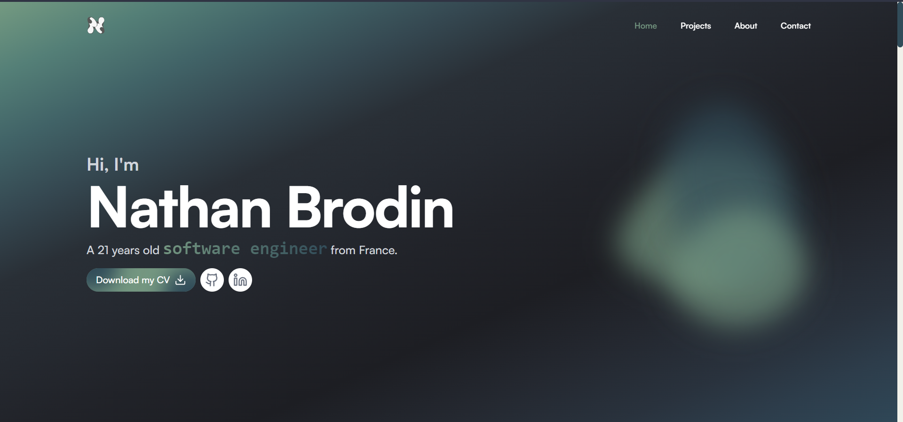

<!-- PROJECT SHIELDS -->
<!--
*** I'm using markdown "reference style" links for readability.
*** Reference links are enclosed in brackets [ ] instead of parentheses ( ).
*** See the bottom of this document for the declaration of the reference variables
*** for contributors-url, forks-url, etc. This is an optional, concise syntax you may use.
*** https://www.markdownguide.org/basic-syntax/#reference-style-links
-->
[![Contributors][contributors-shield]][contributors-url]
[![Forks][forks-shield]][forks-url]
[![Stargazers][stars-shield]][stars-url]
[![Issues][issues-shield]][issues-url]
[![MIT License][license-shield]][license-url]
[![LinkedIn][linkedin-shield]][linkedin-url]

<!-- PROJECT LOGO -->
 

  

  <h3 align="center">Nathan Brodin | Portfolio</h3>

  

    My portfolio to showcase my projects and professional journey!
     
    <a href="https:///nathanbrodin.com"><strong>Explore the website »</strong></a>
     
     
    <a href="https://github.com/NathanBrodin/nathanbrodin.com/">Leave a star</a>
    ·
    <a href="https://github.com/NathanBrodin/nathanbrodin.com/issues">Report Bug</a>
  

<!-- ABOUT THE PROJECT -->
## About The Project

My portfolio is a carefully curated showcase of my professional journey and past projects. Developed using Next.js (React.js) with TypeScript, Tailwind CSS, and Framer Motion, it highlights my technical skills and dedication to creating interactive and visually engaging user experiences.

### Built With

* [![Next][Next.js]][Next-url]
* [![React][React.js]][React-url]
* [![Tailwind-CSS][TailwindCSS]][Tailwind-url]

<!-- LICENSE -->
## License

Distributed under the MIT License. See `LICENSE.md` for more information.

<!-- CONTACT -->
## Contact

Nathan Brodin - [nathan-brodin](https://www.linkedin.com/in/nathan-brodin)

Project Link: [https://github.com/NathanBrodin/nathanbrodin.com](https://github.com/NathanBrodin/nathanbrodin.com)

(<a href="#readme-top">back to top</a>)

<!-- MARKDOWN LINKS & IMAGES -->
<!-- https://www.markdownguide.org/basic-syntax/#reference-style-links -->
[contributors-shield]: https://img.shields.io/github/contributors/nathanbrodin/nathanbrodin.com?style=for-the-badge
[contributors-url]: https://github.com/NathanBrodin/nathanbrodin.com/graphs/contributors
[forks-shield]: https://img.shields.io/github/forks/nathanbrodin/nathanbrodin.com?style=for-the-badge
[forks-url]: https://github.com/NathanBrodin/nathanbrodin.com/network/members
[stars-shield]: https://img.shields.io/github/stars/nathanbrodin/nathanbrodin.com?style=for-the-badge
[stars-url]: https://github.com/NathanBrodin/nathanbrodin.com/stargazers
[issues-shield]: https://img.shields.io/github/issues/nathanbrodin/nathanbrodin.com?style=for-the-badge
[issues-url]: https://github.com/NathanBrodin/nathanbrodin.com/issues
[license-shield]: https://img.shields.io/github/license/nathanbrodin/nathanbrodin.com?style=for-the-badge
[license-url]: https://github.com/NathanBrodin/nathanbrodin.com/blob/main/LICENSE.txt
[linkedin-shield]: https://img.shields.io/badge/-LinkedIn-black.svg?style=for-the-badge&logo=linkedin&colorB=555
[linkedin-url]: https://linkedin.com/in/nathan-brodin
[Next.js]: https://img.shields.io/badge/next.js-000000?style=for-the-badge&logo=nextdotjs&logoColor=white
[Next-url]: https://nextjs.org/
[React.js]: https://img.shields.io/badge/React-20232A?style=for-the-badge&logo=react&logoColor=61DAFB
[React-url]: https://reactjs.org/
[TailwindCSS]: https://img.shields.io/badge/Tailwind-20232A?style=for-the-badge&logo=tailwind-css&logoColor=61DAFB
[Tailwind-url]: https://tailwindcss.com/
